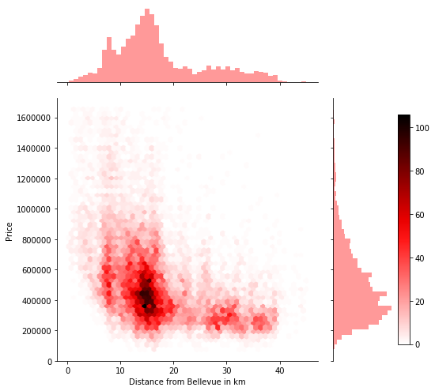

# An Analysis of Kings County Housing Prices


<h2>Purpose</h2>
The purpose of this project is to investigate what features affect the price of house in the Kings County area and then build a linear regression model to predict price as accurately as possible. 


<h2>Data Description</h2>
The Repo is split up into 6 folders 

```
Questions:
* Question 1.ipynb
    - How are Houses in Kings County Distributed and the effect of Zipcodes on price
* Question 2.ipynb
    - Does distance from the city have an affect on House Price?
* Question 3.ipynb
    - Are Waterfront properties more expensive?

Data:
* cleaned_geodata.json
* data_correlation_gone.csv
* datawithnewcols.csv
* kc_house_data.csv
* Zip_Codes.geojson


Cleaning:Exploring:
Contains notebooks where data cleaning and exploring was done
* CleaningData.ipynb
* Exploring-my-Data.ipynb
* GettingRidofCorrelationissues.ipynb 

Models:
* Final_Model.ipynb

Maps:
Contains html files of maps created
* count.html
* median.html
* my_map.html
* my_map_radius.html

Images:
* Contains array of images that are use in the powerpoint pdf

```

<h2> The project follows the OSEMN Process <h2>

<h2> Obtain </h2>
Data was provided in a csv file.

<h2> Scrubbing and Cleaning </h2>
Here null values were dealt with, as well as data types etc.
The following features were also created:
<ul>
<li>Age of House</li>
<li> Number of Years since last renovation </li>
<li> Distance from Seattle </li>
<li> Distance from Bellevue </li>
<li> Distance from nearest City </li>
<li> Distance from International Airport</li>
<li> Bigger sqft living than surrounding 15 houses?</li>
<li> Bigger sqft lot than surrounding 15 houses?</li>
<li> Is there a basement?</li>
</ul>

<h2> Exploring</h2>
I explored all the data, and made visualisations to provide insights. I focused on the following 3 questions.

<h3>Question 1: How are Houses in Kings County Distributed and the effect of Zipcodes on price?</h3>
Yes, zipcodes directly surrounding Bellevue have higher counts of houses than zip  codes further out.
<br>
 <br>


<h5> Do House Prices vary by Zipcode?</h5>
From below, it is clear that the average house price is very different based on the zipcode 
<br>

<br>

Houses in the North of the County, notably surrounding bellevue, are the most expensive.
With houses in the south of the county being cheaper


<br>  <br>
<h3>Question 2: Does distance from the city have an affect on House Price?</h3>


<h5> Conclusion:</h5>
* It is clear that houses above 1milllion are located withing 20km of Bellevue

*  Houses above $1million are located within 20km of Bellevue
* The further away from the City, the lower the average hosus eprice.

<h5> Simply Regression Model:</h5>

An increase in 1km from the city results in a decrease in price by  USD 12,264
<br>   <br>


<br>   <br>
<h2>Question 3: Are Waterfront properties more expensive?</h2>

<h5>Findings:</h5>
Yes, it is clear waterfront properties are more expensive

The mean and median price of a waterfront home is  USD1.7m and USD 1.5m respectively.

The mean and median price of a home that is not on the waterfront is USD 532k and USD450k respectively. 

That is a difference of USD 1m between the average home prices of a waterfront and no waterfront property

This massive disparity in price is most likely down to how little waterfront proeprties there are, with less than 1% of the homes in the dataset having one


<br>  <br>
 


<h2>Future Work</h2>
<ol>
<li>Zip code Feature - Create a boundary selector to enable the model to predict price depending on zip code</li>

<li>More Data  - Collate data for the passed 20 years to see how 
</ol>

